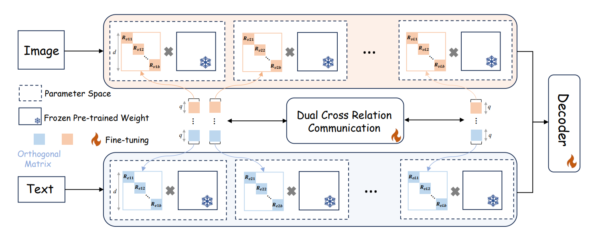








I am a third-year PhD student at Shanghai Jiao Tong University (SJTU), supervised by Prof. Wei Shen. My research interests include parameter-efficient learning, semantic segmentation, and medical image analysis. Please feel free to contact me through email: zelin.peng@sjtu.edu.cn.

My research interest includes multi-modal learning and medical image segmentation. I have published more than 20 papers at the top international AI conferences with total <a href='https://scholar.google.com/citations?user=6mYmXrEAAAAJ'>google scholar citations <strong>260+</strong></a>.

# 🔥 News
- *2025.02*: &nbsp;🎉🎉 Six papers have been accepted by CVPR 2025, with **three** of them as first-author contributions. 
- *2024.12*: &nbsp;🎉🎉 One paper has been accepted by AAAI 2025.
- *2024.03*: &nbsp;🎉🎉 One paper has been accepted by CVPR 2024 as a first-author contribution.
- *2023.12*: &nbsp;🎉🎉 One paper has been accepted by AAAI 2024 as a first-author contribution.
- *2023.07*: &nbsp;🎉🎉 One paper has been accepted by ICCV 2023 as a first-author contribution.

# 📝 Selected Publications 

CVPR 2025

[Understanding Fine-tuning CLIP for Open-vocabulary Semantic Segmentation in Hyperbolic Space](https://godlin-sjtu.github.io/)

**Zelin Peng**, Zehngqin Xu, Zhilin Zeng, Changsong Wen, Yu Huang, Menglin Yang, Feilong Tang, Wei Shen

CVPR 2025

[Parameter-efficient Fine-tuning in Hyperspherical Space for Open-vocabulary Semantic Segmentation](https://godlin-sjtu.github.io/)

**Zelin Peng**, Zehngqin Xu, Zhilin Zeng, Yu Huang, Yaoming Wang, Wei Shen

# 🎖 Honors and Awards
- *2024.11* National Scholarship. 
- *2021.10* National Scholarship. 

# 📖 Educations
-   *2022.09 - 2026.06 (now)*, PhD student of Shanghai Jiaotong University, supervised by Prof. Wei Shen.
-   *2019.09 - 2022.06*, Master student of Xidian University, supervised by Prof. Xiangrong Zhang.
-   *2015.09 - 2019.06*, Undergraduate student of Xidian University.

# 💻 Internships
- *2023.08 - 2024.12*, Huawei, Shanghai, China.
